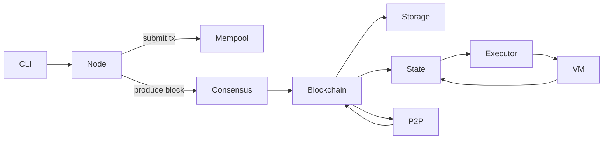

#节点依赖关系（运行时）

```mermaid
flowchart LR
    CLI --> Node

    Node -->|submit tx| Mempool
    Node -->|produce block| Consensus
    Consensus --> Blockchain

    Blockchain --> Storage
    Blockchain --> State

    State --> Executor
    Executor --> VM

    VM --> State

    Blockchain --> P2P
    P2P --> Blockchain
```
