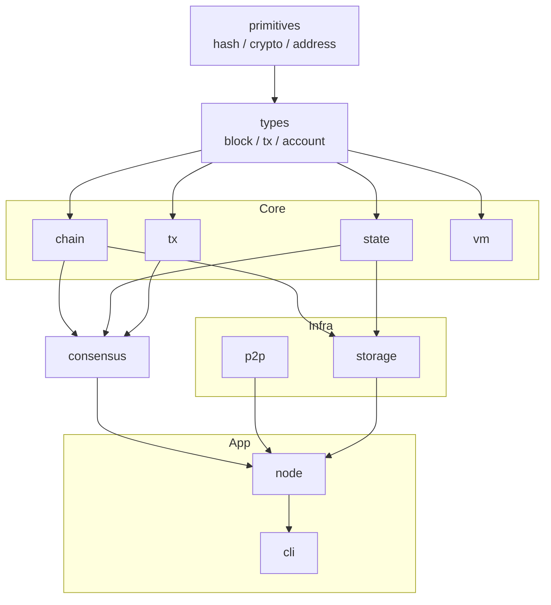
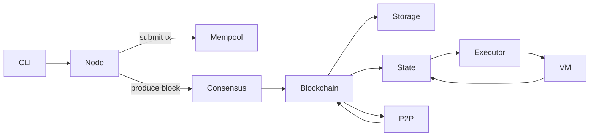
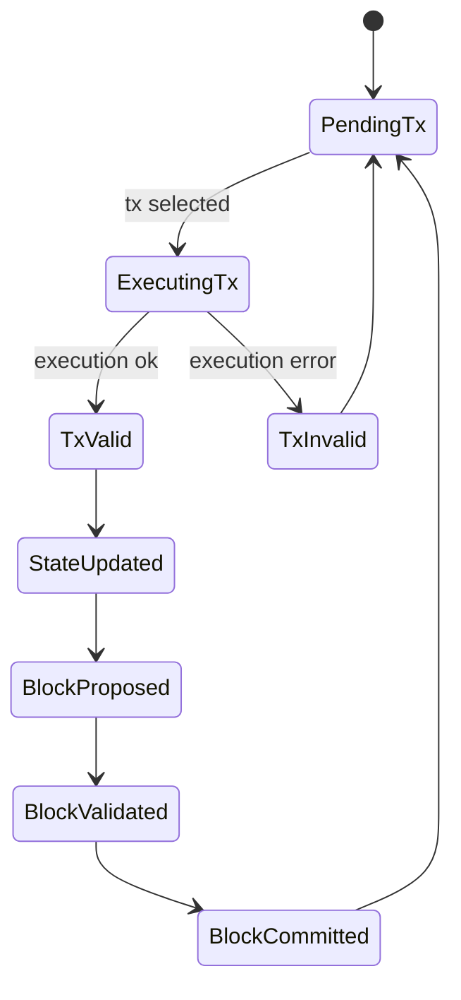
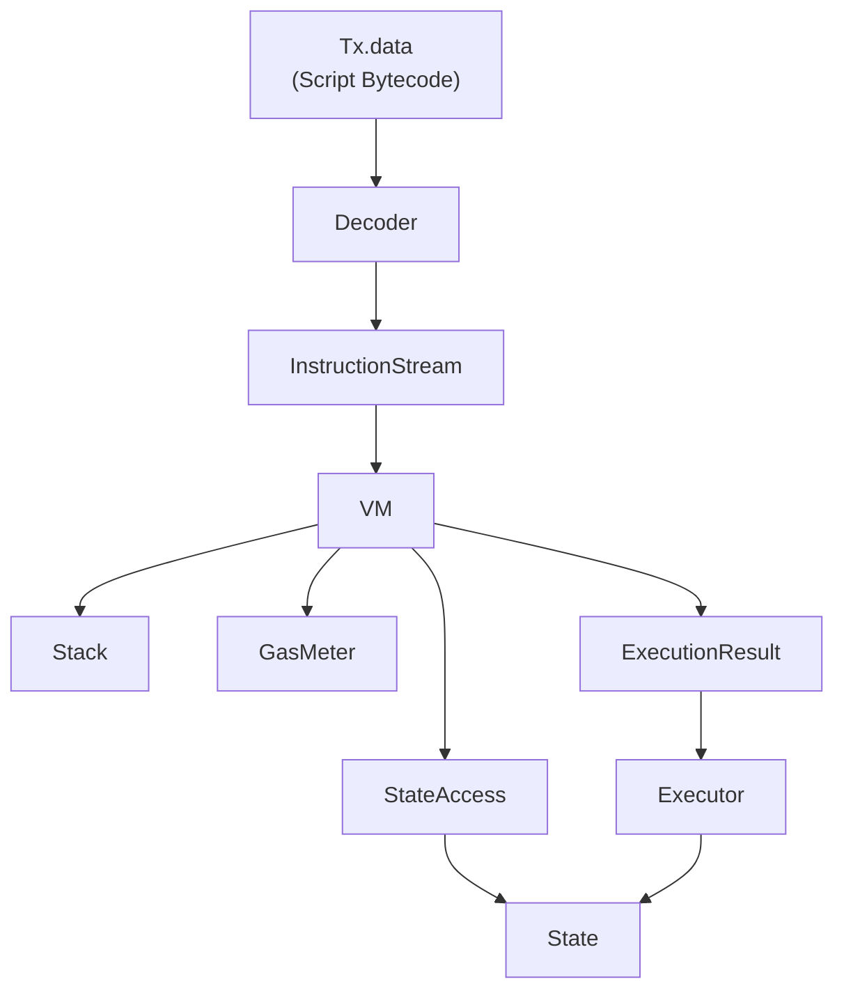
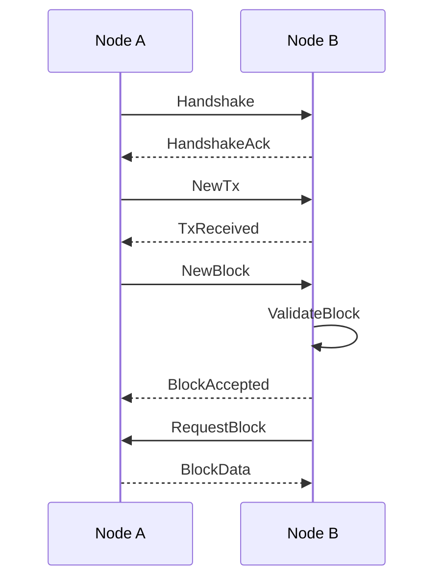
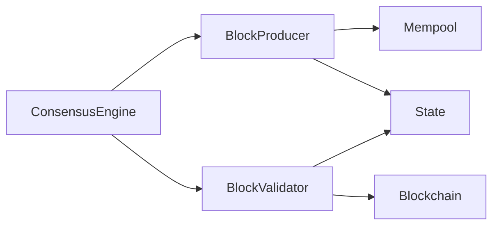

# 工程结构

1. 工程模块依赖关系（crate 级）

``` mermaid
graph TD
    primitives["primitives<br/>hash / crypto / address"]
    types["types<br/>block / tx / account"]

    primitives --> types

    types --> chain
    types --> tx
    types --> state
    types --> vm

    chain --> consensus
    state --> consensus
    tx --> consensus

    chain --> storage
    state --> storage

    consensus --> node
    p2p --> node
    storage --> node

    node --> cli

    subgraph Core
        chain
        state
        vm
        tx
    end

    subgraph Infra
        p2p
        storage
    end

    subgraph App
        node
        cli
    end
```
2. 节点依赖关系（运行时）

```mermaid
flowchart LR
    CLI --> Node

    Node -->|submit tx| Mempool
    Node -->|produce block| Consensus
    Consensus --> Blockchain

    Blockchain --> Storage
    Blockchain --> State

    State --> Executor
    Executor --> VM

    VM --> State

    Blockchain --> P2P
    P2P --> Blockchain
```

3. 状态机关系图

```mermaid
stateDiagram-v2
    [*] --> PendingTx

    PendingTx --> ExecutingTx : tx selected
    ExecutingTx --> TxValid : execution ok
    ExecutingTx --> TxInvalid : execution error

    TxValid --> StateUpdated
    TxInvalid --> PendingTx

    StateUpdated --> BlockProposed
    BlockProposed --> BlockValidated
    BlockValidated --> BlockCommitted

    BlockCommitted --> PendingTx
```

4. Script VM执行图

```mermaid
flowchart TB
    TxData["Tx.data<br/>(Script Bytecode)"] --> Decoder
    Decoder --> InstructionStream
    InstructionStream --> VM

    VM --> Stack
    VM --> GasMeter
    VM --> StateAccess

    StateAccess --> State
    VM --> ExecutionResult

    ExecutionResult --> Executor
    Executor --> State
```

5. P2P 网络与节点同步

```mermaid
sequenceDiagram
    participant A as Node A
    participant B as Node B

    A->>B: Handshake
    B-->>A: HandshakeAck

    A->>B: NewTx
    B-->>A: TxReceived

    A->>B: NewBlock
    B->>B: ValidateBlock
    B-->>A: BlockAccepted

    B->>A: RequestBlock
    A-->>B: BlockData
```

6. 共识模块内部关系

```mermaid
flowchart LR
    ConsensusEngine --> BlockProducer
    ConsensusEngine --> BlockValidator

    BlockProducer --> Mempool
    BlockProducer --> State

    BlockValidator --> Blockchain
    BlockValidator --> State
```